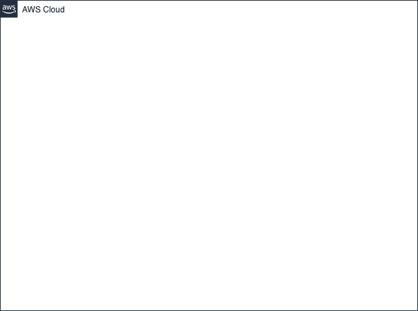

# nuxt-rails-sample

## 構成図


## 開発環境
- Nuxt側
```
make up
make web
```
http://localhost:3000/

- Rails側
```
make up
make app
```
http://localhost:8000/

## 本番環境
- パラメータストアにDBのパスワードを保存
```
aws ssm put-parameter --name "RailsApiRDS" --value "your_db_password" --type "SecureString"
```

- cdk手動デプロイ
```
npx cdk deploy --all
```

- EC2へSSM経由でSSH
```
ssh ec2-user@<your_ec2_instance_id> -i <your_private_key>
```

- EC2でのセットアップ
```
sudo yum -y update
sudo yum -y install git make gcc-c++ patch openssl-devel libyaml-devel libffi-devel libicu-devel libxml2 libxslt libxml2-devel libxslt-devel zlib-devel readline-devel ImageMagick ImageMagick-devel
sudo amazon-linux-extras install -y nginx1
sudo systemctl enable nginx
sudo systemctl start nginx
sudo yum -y remove mariadb-libs
sudo yum localinstall -y https://dev.mysql.com/get/mysql80-community-release-el7-3.noarch.rpm
sudo yum-config-manager --disable mysql80-community
sudo yum-config-manager --enable mysql57-community
sudo rpm --import https://repo.mysql.com/RPM-GPG-KEY-mysql-2022
sudo yum -y install mysql-community-client mysql-server mysql-devel
```

- RDSへ接続
```
mysql -h <your_rds_endpoint> -u api -p
```

- DBのパスワードを取得
```
aws ssm get-parameter --name "RailsApiRDS" --with-decryption
```