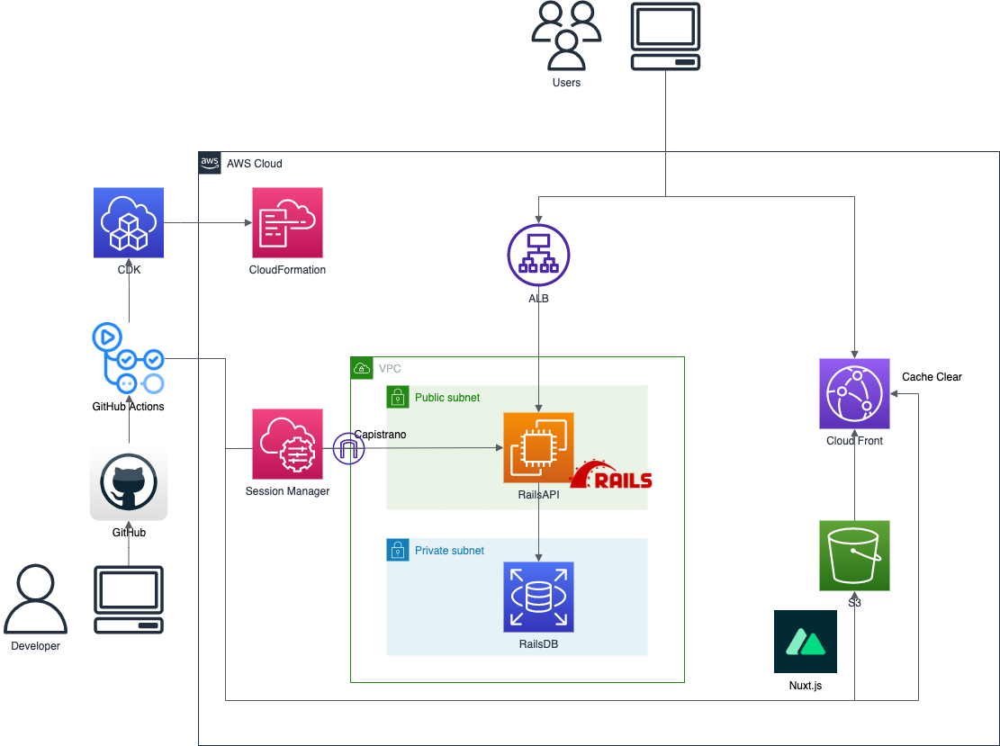

# nuxt-rails-sample

## 構成図


## 開発環境
- Nuxt側
```
make up
make web
```
http://localhost:3000/

- Rails側
```
make up
make app
```
http://localhost:8000/

## 本番環境
必要な環境変数を設定する必要があります。
- cdk/.env
```
HOSTED_ZONE_ID=
ZONE_NAME=
CERTIFICATE_ARN=
KEY_NAME=
```

- api/.env
```
TARGET_INSTANCE_ID=
```

- front/.env
```
API_BASE_URL=
```

### API側
- パラメータストアにDBのパスワードを保存
```
aws ssm put-parameter --name "RailsApiRDS" --value "your_db_password" --type "SecureString"
```

- cdk手動デプロイ
```
npx cdk deploy --all
```

- EC2へSSM経由でSSH
```
ssh ec2-user@<your_ec2_instance_id> -i <your_private_key>
```

- EC2でのセットアップ
```
sudo yum -y update
sudo yum -y install git make gcc-c++ patch openssl-devel libyaml-devel libffi-devel libicu-devel libxml2 libxslt libxml2-devel libxslt-devel zlib-devel readline-devel ImageMagick ImageMagick-devel
sudo amazon-linux-extras install -y nginx1
sudo systemctl enable nginx
sudo systemctl start nginx
sudo yum -y remove mariadb-libs
sudo yum localinstall -y https://dev.mysql.com/get/mysql80-community-release-el7-3.noarch.rpm
sudo yum-config-manager --disable mysql80-community
sudo yum-config-manager --enable mysql57-community
sudo rpm --import https://repo.mysql.com/RPM-GPG-KEY-mysql-2022
sudo yum -y install mysql-community-client mysql-server mysql-devel
```

- RDSへ接続
```
mysql -h <your_rds_endpoint> -u api -p
```

- DBのパスワードを取得
```
aws ssm get-parameter --name "RailsApiRDS" --with-decryption
```

- Rubyのインストール
```
git clone https://github.com/sstephenson/rbenv.git ~/.rbenv
echo 'export PATH="$HOME/.rbenv/bin:$PATH"' >> ~/.bash_profile
echo 'eval "$(rbenv init -)"' >> ~/.bash_profile
source ~/.bash_profile
git clone https://github.com/sstephenson/ruby-build.git ~/.rbenv/plugins/ruby-build
rbenv install 2.6.6
rbenv global 2.6.6
rbenv rehash
gem install bundler
```

- デプロイ先の設定
```
sudo mkdir -p /var/www/api
sudo chown `whoami`:`whoami` /var/www/api
```

- gitの設定
```
cd .ssh
ssh-keygen -t rsa -f "api_git_rsa" -N ""
cat <<EOF > ~/.ssh/config
Host github github.com
  Hostname github.com
  User git
  IdentityFile ~/.ssh/api_git_rsa
EOF
chmod 600 config
```
その後`api_git_rsa.pub`をGitHubの`Settings -> SSH and GPG keys -> New SSH key`で登録

- RDSへの接続先情報登録
```
export AWS_ACCESS_KEY_ID=your_aws_access_key_id
export AWS_SECRET_ACCESS_KEY=your_secret_access_key
make up
make bash
bundle install
EDITOR=vi rails credentials:edit
```
- 以下のように接続情報を記載
```
db:
  password: RDSのパスワード
  hostname: RDSのエンドポイント
```

- 一度デプロイを実行してmaster.keyを配置
```
source .env
TARGET_INSTANCE_ID=$TARGET_INSTANCE_ID bundle exec cap production deploy

# 「ERROR linked file /var/www/api/shared/config/master.key does not exist on your_servername」

scp config/master.key your_server_name:/var/www/api/shared/config
TARGET_INSTANCE_ID=$TARGET_INSTANCE_ID bundle exec cap production puma:config
TARGET_INSTANCE_ID=$TARGET_INSTANCE_ID bundle exec cap production puma:systemd:config puma:systemd:enable
```

- 再度デプロイ
```
TARGET_INSTANCE_ID=$TARGET_INSTANCE_ID bundle exec cap production deploy
```

- Nginxの設定
```bash:
# EC2
cd /etc/nginx
sudo mkdir sites-available
# local
bundle exec cap production puma:nginx_config
# EC2
sudo systemctl restart nginx
curl -X GET http://localhost/v1/todos -v
```
以上で200番が返ってくればOK

### Front側
- Nuxtのビルド
```
cd front
npm run generate
```

- S3へのアップロード
```
aws s3 sync front/dist s3://nuxt.s3bucket/ --include "*"
```

- CloudFrontのキャッシュ削除
```
export DISTRIBUTIN_ID=XXXXXXXXXXXXXX
aws cloudfront create-invalidation --distribution-id $DISTRIBUTIN_ID --paths "/*"
```